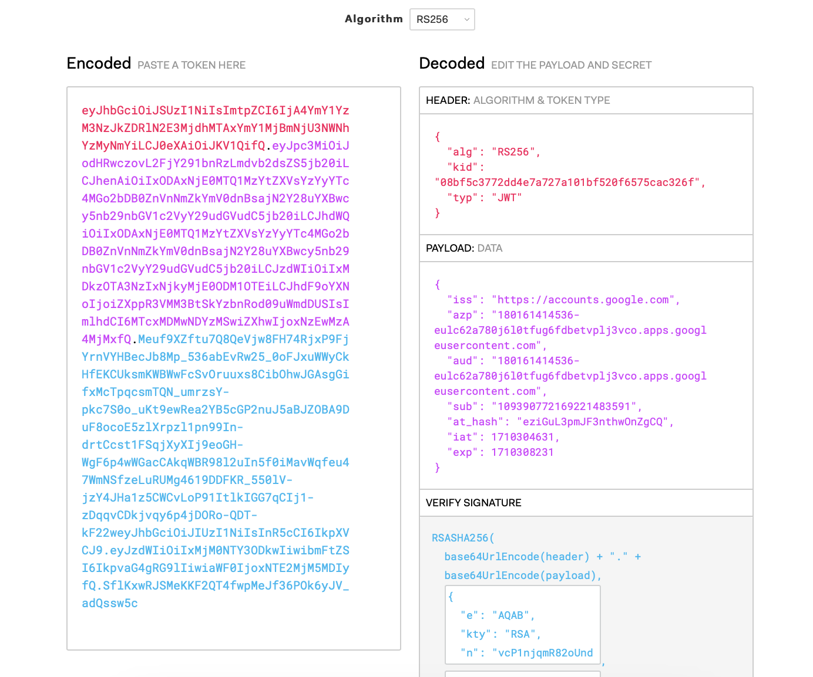

# Consuming a Google ID Token from a server

Reference Article [Consuming a Google ID Token from a server](https://ncona.com/2015/02/consuming-a-google-id-token-from-a-server/)

Before we can trust a token that comes from a google auth server, we need to validate it. 

To validate it we need to perform the following checks:
- Verify that the value of the aud field in the ID token is identical to your app’s client ID and that the iss is `accounts.google.com`
- Verify that the ID token is a JWT which is properly signed with an appropriate Google public key and 
- Validate if token has not expired

Here is a sample view of what a token we obtained from google auth looks like in jwt.io 

Refer [OAuth Middleware File](../src/middlewares/oauth.middleware.ts) to see this in action.
