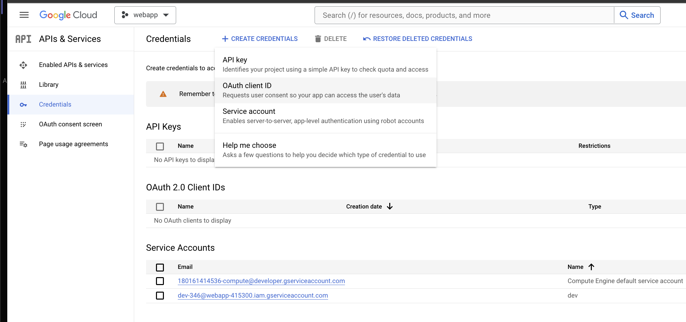
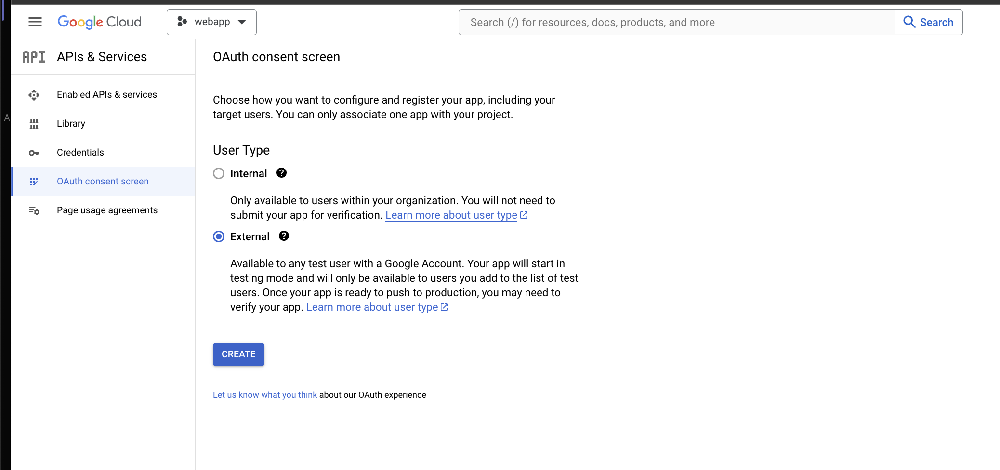
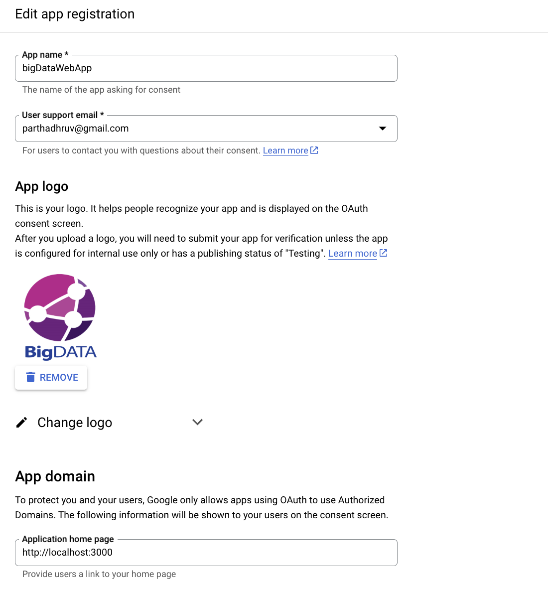
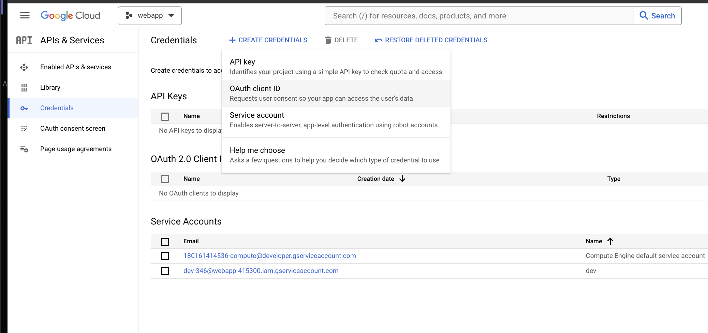
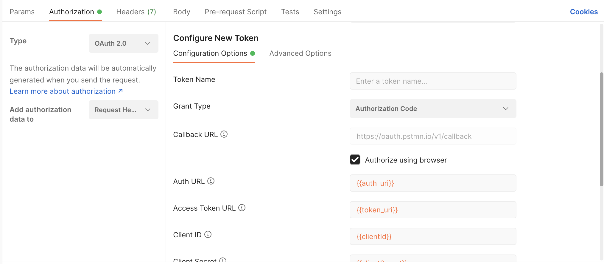
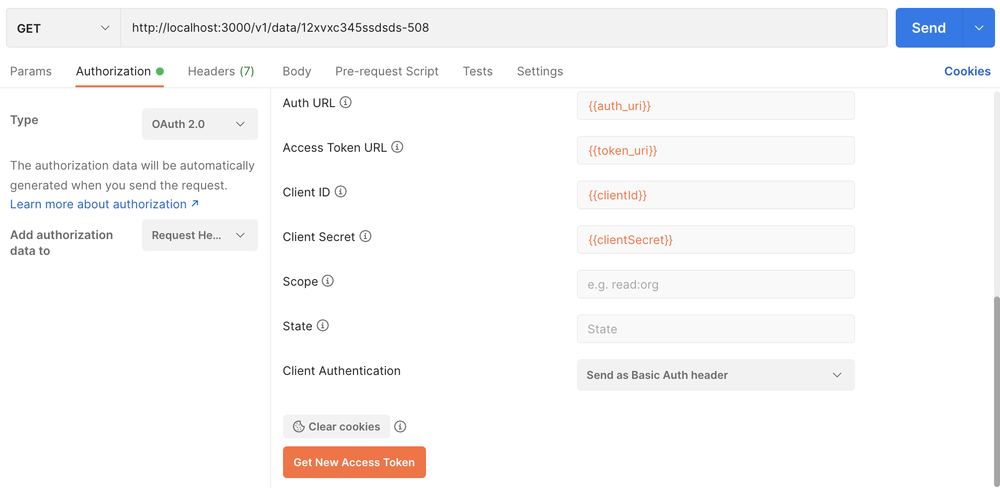
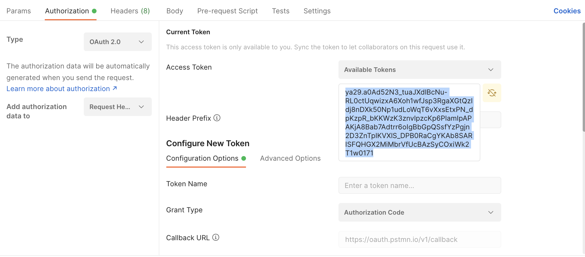

# Setting up OAuth

## [Obtaining Client Credentials](https://console.cloud.google.com/apis/credentials)

Create an OAuth Client Id - here we are first registering our web application (Register Flow)

Requests user consent so that app can access user data.

Start designing OAuth Consent screen
 

 We need to add http://localhost:3000 as the application home page.
 

Creating the OAuth Client credentials

Once created save the credentials we have to proceed to obtain the auth token through postman, by exchaning the client credential with the google auth server.

## Obtaining Auth Token

- GCloud Auth URl: https://accounts.google.com/o/oauth2/v2/auth
- Token URl: https://accounts.google.com/o/oauth2/v2/auth

We head over to postman and add the following under the Authorization tab to obtain the auth token.

Check list of available scopes on https://developers.google.com/identity/protocols/oauth2/scopes

We pick the one that says 
`openid`	Associate you with your personal info on Google

Once we complete this step, we are directed to google's login page, and once we authorize the request, we are brought back to Postman with the access token. 

