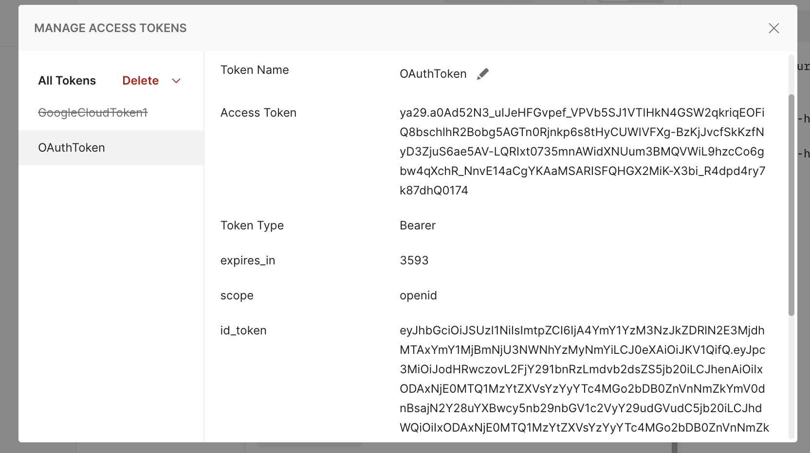

# Verifying the token

We will be using the id_token to start with instead of the access token. But [what is the difference ?](https://auth0.com/blog/id-token-access-token-what-is-the-difference/)

### ID Tokens and OpenID connect

OpenID connect is an open standard for decentralized authentication. This is used by most of the popular identity providers out there. 

Users can use the openid workflow and the output of this is an `id_token` that proves that an user is authenticated. These are encoded as JWTs. In the assignment that we are building, when we try to obtain the access token from the auth server, we are also sent an ID_token along with the access token. See image here:

The ID token contains information about the user who aproved the request that was sent to the auth server. The Payload part of the (JWT) Id token oftentimes contains this user information and can be used within the client side application to store logged in user's infromation such as their name and other details.

#### When should we not use an ID Token
- ID tokens are not meant for authorization
- ID tokens should not be sent to an API
- ID tokens do not have any authorization information inside them, so they are useless to be sent to an API anyway

### Access Tokens and OAuth 2.0

OAuth 2.0 is designed to allow and application access to specific resources on behalf of an user. Access tokens can be of any format, but oftentimes, it will be of the JWT format. This is however not a requirement. The access token that we received from google auth server do not seem to be in the JWT format. 

Unlike the ID token that contains information about the user who authorized the login, the access token contains information regarding which resources that the client has access to. So the recepient of the access token is the resource server that the client wants to retrieve information from. 

#### When shuold we not use an Access token
- Access tokens are not meant for authentication
- Based on the access token we should not make any assuptions about the user's identity or the fact that they are logged in or not
- Access token is not a guarantee that the user is logged in at all

## Which one to go with ?

https://developers.google.com/identity/protocols/oauth2/javascript-implicit-flow

Reading through the above resource, we notice that it makes sense to pass in the access token to the API calls that we make to google's end points to access it's resources. But in our use case, we arent going to send any APIs to google's end points as of Demo2. Hence there is no need to be using the Access tokens. So we are going to stick with using the ID tokens. 

These ID tokens are in JWT format, so we are going to use a set of steps to validate all requests against the provided JWT token in our server. 
